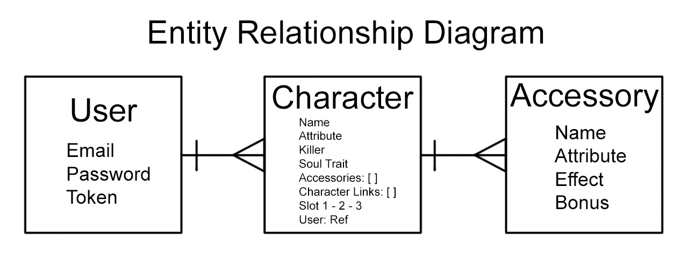

# Bleach Brave Souls Tracker

This application is an organizer to help fans of Bleach Brave Souls track the numerous amount of characters that they have collected.

 ---
## Entity Relationship Diagram

 ---

|    NAME    |              PATH             |     ACTION    |                 PURPOSE                 |
| ---------- | ----------------------------- | ------------- | --------------------------------------- |
|   Create   |  /characters                  |   POST        | Creates an Entry                        |
|   Index    |  /characters                  |   GET         | Shows All Entries Added on Main Page    |
|   Show     |  /characters/:id              |   GET         | Used to Refresh When Updating           |
|   Update   |  /characters/:id              |   PATCH       | Updates an Entry                        |
|   Delete   |  /characters/:id              |   DELETE      | Deletes an Entry                        |
|   Create   |  /accessories                 |   POST        | Creates an Accessory in an Empty Slot   |
|   Update   |  /accessories/:accessoryId    |   PATCH       | Updates or Clears an Accessory          |
|   Create   |  /sign-up                     |   POST        | Create a New User                       |
|   Create   |  /sign-in                     |   POST        | Generates a Token for an Existing User  |

---
## Languages & Tools

What was used:
- Javascript
- HTML
- CSS
- Photoshop
- Node.js, MongoDB, Mongoose, Express, Cors, Bcrypt, JSON Web Token, Passport-JWT 

---
## FUTURE UPDATES

### Version 2.0
- As a user, I want a Search Bar.
- As a user, I want a way to Filter the list of Characters I Added through Tabs.

### Version 3.0
- As a user, I want some of these fields to have a drop down menu instead of manually entering in the Data.
- As a user, I want some of these fields that were picked from the drop down menu to instantiate an image to give a better representation of what has been picked.