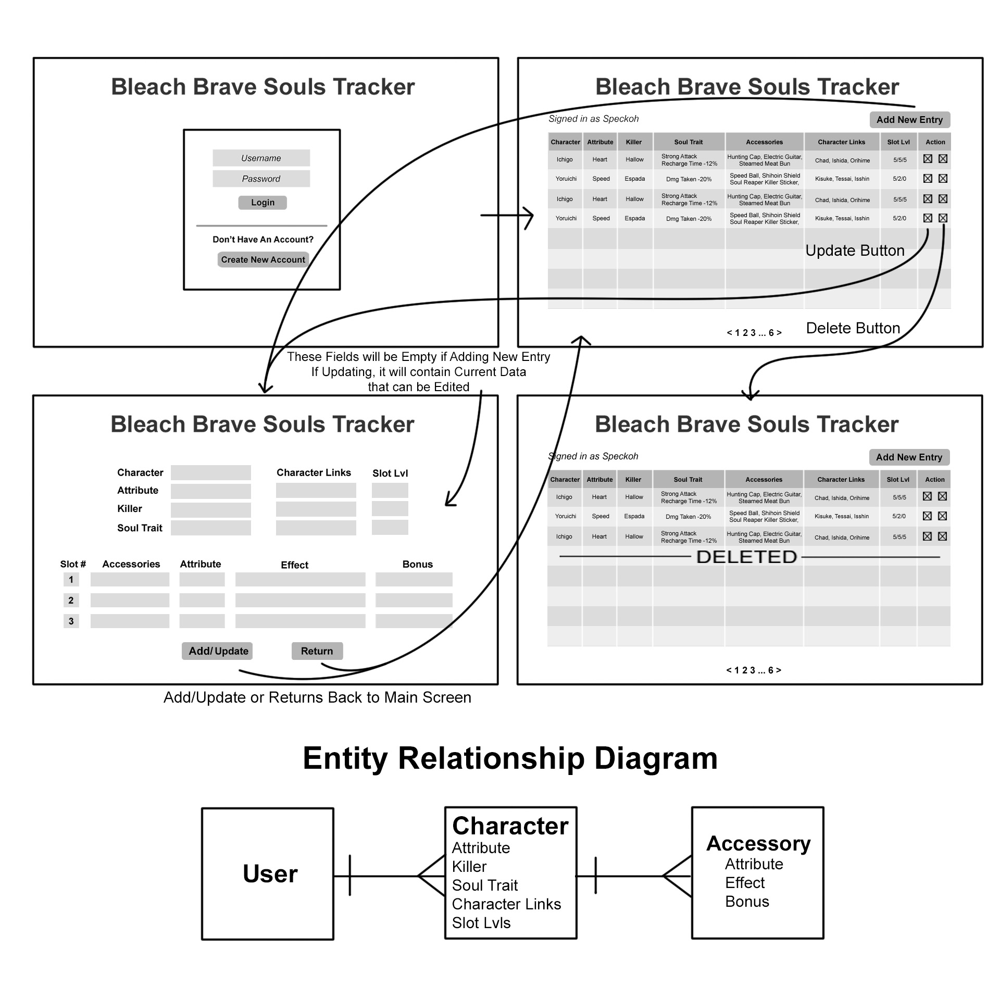

# Bleach Brave Souls Tracker

This CRUD Application is an organizer to help me track the numerous amount of characters that I have collected in Bleach Brave Souls, which is a game I recently started playing based off a popular Anime that I enjoy.

 ---
## WireFrames & ERD

 ---
## MVP

### Version 1.0
- As a user, I want to be able to Sign Up.
- As a user, I want to be able to Sign In.
- As a user, I want to be able to Add Characters to Track.
- As a user, I want to be able to See the Characters I just Added.
- As a user, I want to be able to Update these Characters I Added.
- As a user, I want the option to Remove Characters I Added.
- As a user, I want to see a Character's Links. (Array of Strings)

- As a user, I want to Add any Accessories to my Character.
- As a user, I want to See a Character's Accessories.
- As a user, I want to be able to Update these Accessories.
- As a user, I want the option to Remove Accessories from my Character.

## FUTURE UPDATES

### Version 2.0
- As a user, I want a Search Bar.
- As a user, I want a way to Filter the list of Characters I Added through Tabs.

### Version 3.0
- As a user, I want some of these fields to have a drop down menu instead of manually entering in the Data.
- As a user, I want some of these fields that were picked from the drop down menu to instantiate an image to give a better representation of what has been picked.